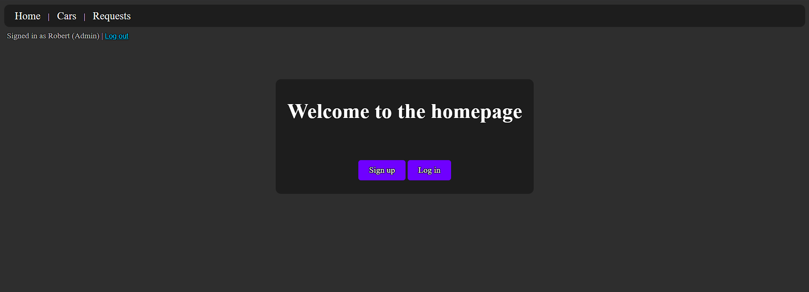
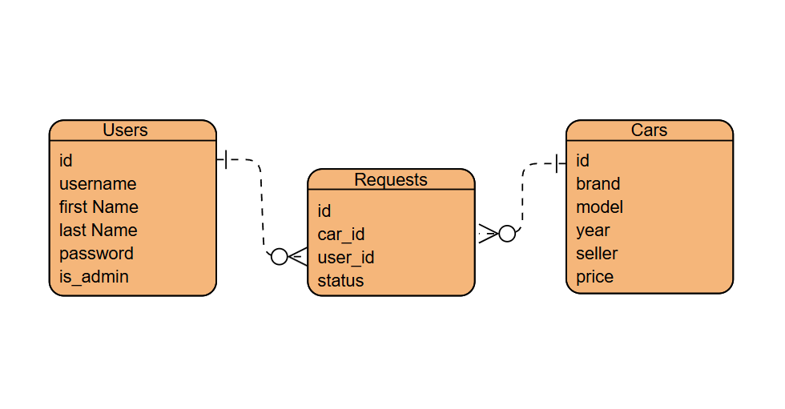

# Car Dealership App

## Description:
This website allows you to log in as either a user or an admin, after which you'll be able to browse the collection of all the cars available for sale, sort them based on the brand you'd like, and request a purchace, after which it'll be removed from the public list and stored as a pending request for an admin to either approve or deny. You'll also be able to add your own cars for sale.
 

## User Stories:
- As a user I would like to access the list of cars available for sale.
- As a user I would like to request a purchase for a car and remove it from the list of available cars.
- As a user I would like to list my car for sale on the site.
- As a user I would like to have a simple, minimalist, easy to navigate interface.
- As an admin I would like to see all the requested cars in a list.
- As an admin I would like to be able to decline requests and put the requested cars back to the available list.

## Technologies used: 
- Python
- PostgreSQL
- Django
- HTML
- CSS
- JavaScript

## Entity Relationship Diagram:

# Lessons Learned:
During this week-long project alone I learned a lot of new things outside of the GA curriculum, some of  which would include:
- How to use the {{message}} feature in Django to provide the user with feedback on their actions within the app.
- How to remove a button upon activation using JS and replace it with a text to let the user know the action has been registered.
- How to implement a try and catch method into a view function, which if failed, returns a 404 not found error.
- How to dynamically change parts of text that would discretely remind the user whether they're signed in or not, and who they're signed in as.

# Next Steps:
This project is a bare minimum MVP of my idea, and due to that it lacks numerous amounts of features that if given more time I would've tried to implement. Here are some ideas I either wanted to but couldn't implement in time, or would implement if I were to expand on this project in general:
- Do an overhaul on the style of the app, as of right now it is very minimal and lacking, needs better color theory, as well as images and logos.
- Change how an admin is created, since the way it is right now is not at all usable if it were a real deployed app.
- Clean up the code and add exception handling where necessary as I dind't have time to take care of some edge cases.
- Make it so that you are immediately logged in with the account that you just created, if you were to create one in the signup view.
- Create  proper tables to house the lists of cars and requests for better readability.
- Add an option to upload photos related to the car you want to add in the add_car view, and create a new view that will allow you view each individual car, browse its photos that were uploaded by the seller, and make a purchase request from there.

